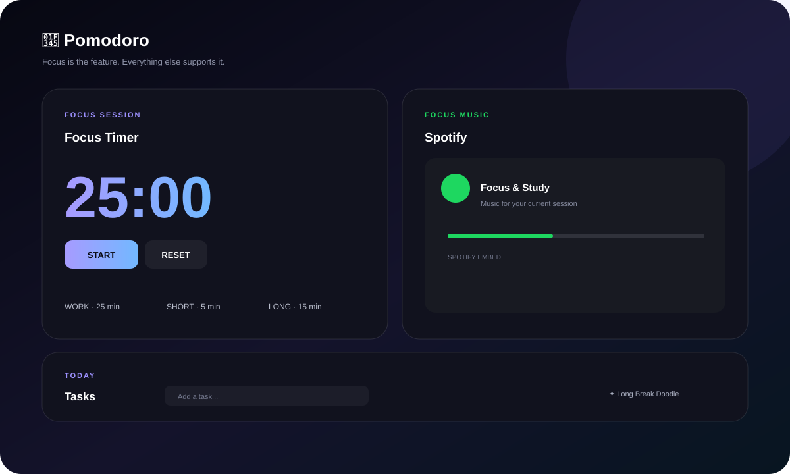
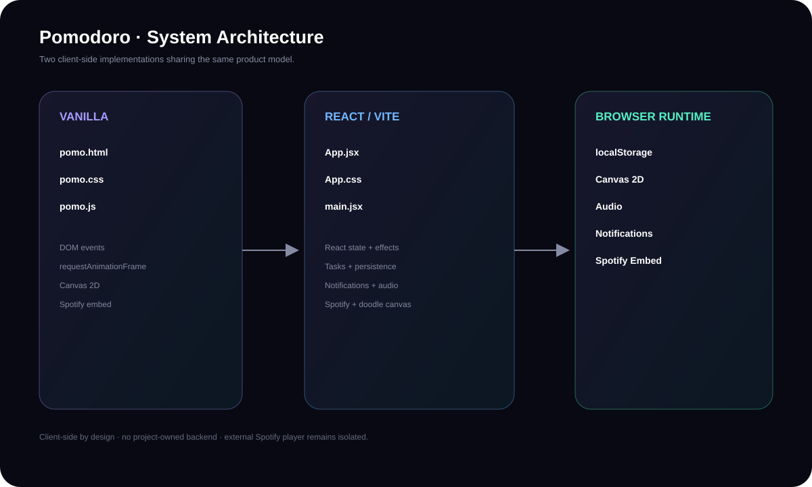
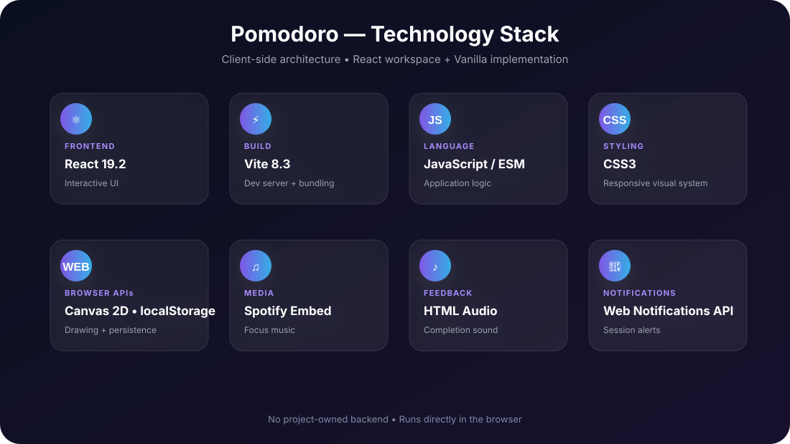

<div align="center">

# 🍅 Pomodoro

### **Focus is the feature. Everything else supports it.**

A polished, client-side Pomodoro workspace combining focused sessions, Spotify study music, task tracking, customizable timing, and a creative Long Break doodle space.

<p><a href="https://github.com/chillingbing648-sketch/Pomodoro"><strong>View Repository</strong></a> · <a href="./pomodoro-react"><strong>React App</strong></a></p>

    

</div>

---

## ✦ The Concept

Pomodoro should not feel like a stopwatch floating on an empty page.

This project turns the timer into a small, focused workspace:

**Timer → Music → Tasks → Creative Break**

The interface is deliberately focused: the timer remains the primary interaction while everything else supports the session.

## 🖼️ Preview



## ⚡ Core Experience

| Feature | Purpose |
|---|---|
| ⏱️ **Pomodoro Timer** | Work, Short Break and Long Break cycles |
| 🔁 **4-Session Rhythm** | Every fourth Work session unlocks the Long Break |
| ⚙️ **Custom Durations** | Configure Work, Short Break and Long Break lengths |
| 🎵 **Spotify Workspace** | Keep study music inside the app |
| ✓ **Task System** | Add, complete and delete tasks |
| 🍅 **Pomodoro Attribution** | Completed Work sessions can increment an unfinished task |
| 🎨 **Long Break Doodle** | Canvas-based creative space |
| 🔔 **Notifications** | Optional browser session alerts |
| 🔊 **Completion Sound** | Audio feedback at session completion |
| 💾 **Local Persistence** | React tasks and theme selection use localStorage |
| ⌨️ **Keyboard Controls** | Space, R and S shortcuts in the React workspace |
| 📱 **Responsive UI** | Desktop and mobile layouts |

## 🧠 Pomodoro Engine

The default rhythm is **25 min Work → 5 min Short Break**, with a **15 min Long Break after every fourth Work session**.

| Session | Default |
|---|---:|
| Work | **25 min** |
| Short Break | **5 min** |
| Long Break | **15 min** |

The React implementation uses a deadline-based timer reference with 250ms UI updates. The vanilla implementation uses `requestAnimationFrame`.

## 🎵 Music Is Part of the Workflow

Spotify is intentionally a major workspace section rather than a tiny external link. The embedded player keeps focus music beside the timer.

Playback and availability are controlled by Spotify and the browser.

## ✓ Tasks + Pomodoro Attribution

Tasks stay lightweight and directly connected to focus sessions. Each task supports completion state, a title, a Pomodoro count, and deletion.

When a Work session completes, the React implementation can attribute the completed Pomodoro to the first unfinished task.

## 🎨 Long Break = Doodle Space

The Long Break changes the interaction model. Instead of another productivity metric, the app exposes a Canvas 2D drawing surface.

- Color picker
- Brush-size control
- Pointer-based drawing
- Clear board action

## 🏗️ Architecture

The repository contains two implementations of the same product idea:

**Vanilla:** `pomo.html` + `pomo.css` + `pomo.js`

**React:** `App.jsx` + `App.css` + `main.jsx` + browser APIs



### Runtime model

User → React UI / DOM → Timer + Session State → Browser APIs → Spotify Embed

Browser APIs currently include `localStorage`, Canvas 2D, Audio, Notifications and `requestAnimationFrame`.

**No project-owned backend or database is required.**

## 🛠️ Technology Stack



| Layer | Technology | Role |
|---|---|---|
| UI | **React 19.2** | Interactive application |
| Build | **Vite 8.3** | Dev server and production bundling |
| Language | **JavaScript / ESM** | Application logic |
| Styling | **CSS3** | Layout and visual system |
| Drawing | **Canvas 2D API** | Long Break doodle workspace |
| Timing | **requestAnimationFrame / deadline refs** | Timer scheduling |
| Storage | **localStorage** | Local task/theme persistence |
| Media | **Spotify Embed** | Focus music |
| Feedback | **HTML Audio** | Completion sound |
| Notifications | **Web Notifications API** | Optional session alerts |
| Quality | **ESLint 10** | Static code checks |

## 📁 Project Structure

```text
Pomodoro/
├── pomo.html
├── pomo.css
├── pomo.js
├── pomodoro-react/
│   ├── index.html
│   ├── package.json
│   ├── package-lock.json
│   └── src/
│       ├── App.jsx
│       ├── App.css
│       ├── index.css
│       └── main.jsx
├── docs/
│   ├── preview.svg
│   ├── architecture.svg
│   └── tech-stack.svg
└── README.md
```

## ⚛ Run the React Workspace

```bash
cd pomodoro-react
npm install
npm run dev
```

Production build:

```bash
npm run build
npm run preview
```

Lint:

```bash
npm run lint
```

## 🚀 Deployment\n\nThe React workspace is configured for GitHub Pages through `.github/workflows/deploy.yml`. Every push to `main` builds `pomodoro-react` and publishes `pomodoro-react/dist`. The workflow can also be started manually from GitHub Actions.\n\n## 🌐 Run the Vanilla Version

No npm setup is required. Open `pomo.html` in a modern browser.

## 🔧 Where to Modify Things

| Change | File |
|---|---|
| React timer/session logic | `pomodoro-react/src/App.jsx` |
| React visual system | `pomodoro-react/src/App.css` |
| React entry | `pomodoro-react/src/main.jsx` |
| Vanilla markup | `pomo.html` |
| Vanilla styling | `pomo.css` |
| Vanilla timer + doodle | `pomo.js` |

## ♢ Design Principles

### 01 — Focus first
The timer is always the primary interaction.

### 02 — Music stays close
Spotify belongs inside the workspace.

### 03 — Tasks stay lightweight
The task layer supports focus instead of becoming project-management software.

### 04 — Breaks should feel different
The Long Break becomes a creative surface.

### 05 — Polish before bloat
The goal is to make the existing experience feel exceptional before adding unnecessary features.

## 🔐 Privacy & Data

The current project is primarily client-side. There is no project-owned backend, database or authentication system.

React local persistence uses browser `localStorage`. Spotify and the completion-sound resource are external services/resources.

## 🚧 Status

**Active development · React workspace evolving**

Core Timer · Integrated  •  Spotify · Integrated  •  Tasks · Integrated  •  Doodle · Integrated  •  Visual Refinement · Ongoing

---

<div align="center">

### 🍅 Focus. Pause. Reset. Repeat.

**A small productivity workspace designed around deep focus.**

<sub>React 19.2 · Vite 8.3 · JavaScript · CSS3 · Canvas 2D · Spotify Embed</sub>

</div>